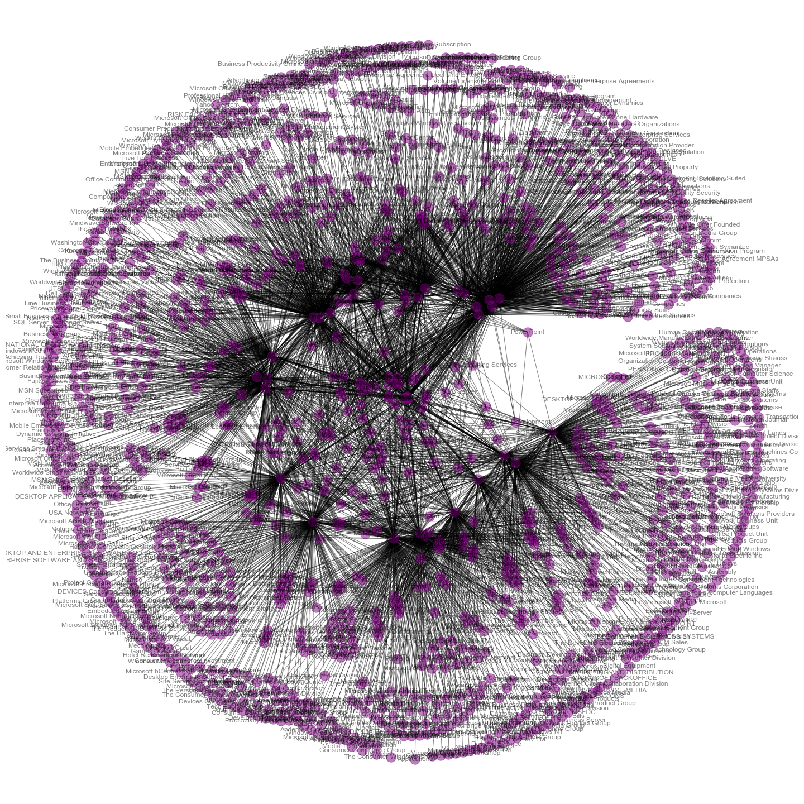
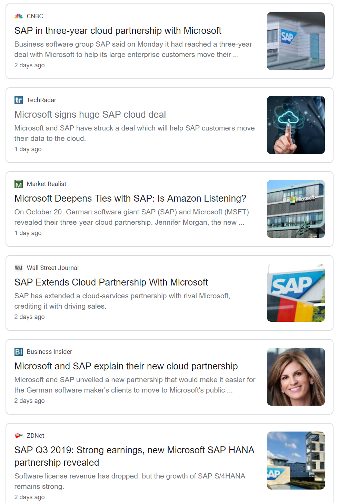
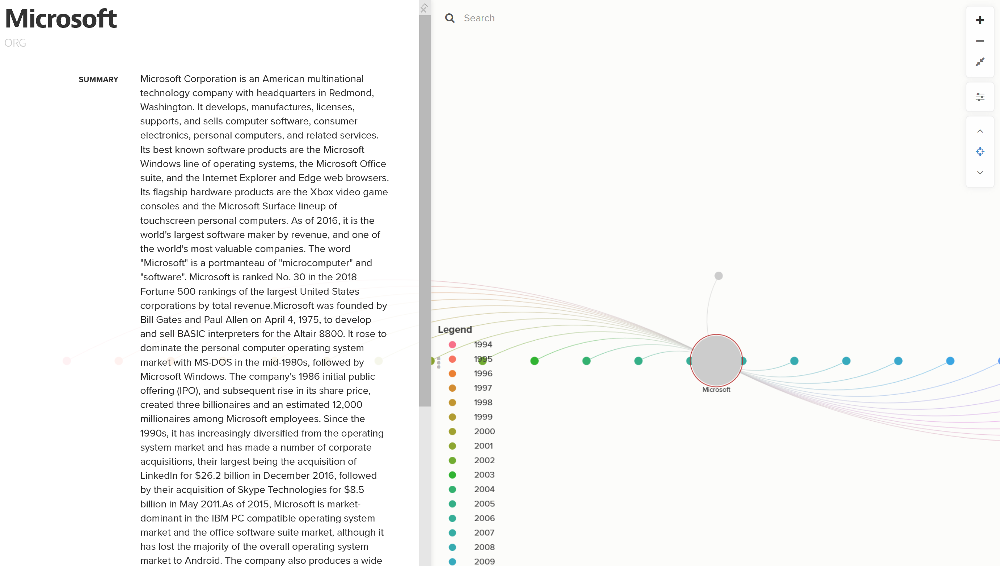
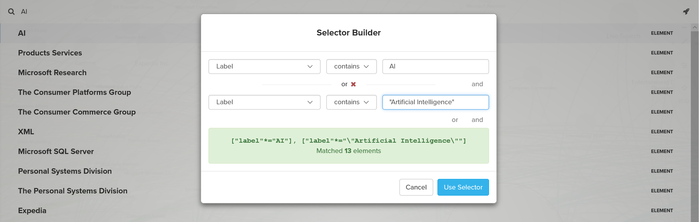
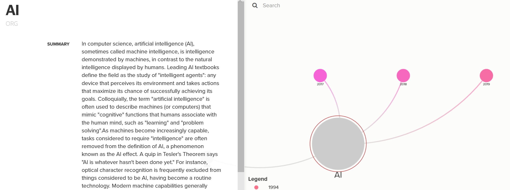
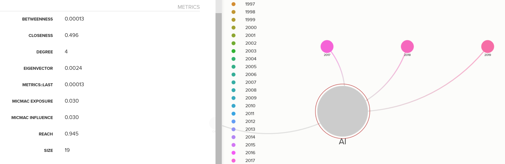

# MICROSOFT THROUGHOUT THE YEARS

## Applying Text Mining and NER on 10-K Filings

## PREFACE

This is not at all meant to be a comprehensive analysis. Nor is it a display of exemplary coding. It's more of an exploratory effort to satisfy my curiosity as to what can be discovered through text across time. There are a few interesting discoveries which could lead to other projects. However, we'll leave that for another time. 😉

## MOTIVATION

How does a company evolve during its years of operation? One method, when evaluating a company’s worth, is to comb through a company’s 10-K and 10-Q filings over periods. These filings can be cumbersome to scrutinize in effort to uncover nuggets of information that can prove valuable. Even then, the determination of what information is valuable is open to interpretation. The question now becomes, how do we extract that golden nugget of information? The study herein will explore various techniques to see if we can extract pertinent information to evaluate the company.

## PROJECT SCOPE

There are hundreds of thousands of companies that have filed with the U.S. Securities and Exchange Commission (SEC) since its inception in 1934. The SEC was created to protect investors against fraudulent and manipulative practices in the market through full public disclosure. All publicly-traded companies are required to disclose business practices and information. The information may contain the breakdown of a company’s finances and assets, management’s discussion, and analysis of the business.

Due to the magnitude of the information available and project constraints, the project will focus on one company and one type of filing, particularly Microsoft Corporation’s 10-K filings. Although each publicly-traded company is required to submit a 10-K, there are no stipulations that dictate the format of the document. Therefore, the structure of the document will differ in structure between companies. And within a single company, the format may change over the years. Depending on the objective, these nuances can make it a challenge to analyze.

## TASKS

The aim of the project herein is to extract keywords, terms, topics, companies, organization, products mentioned in PART I of the filing. In Microsoft’s 10-K filings, PART I contains information about its products, services, research, competitors, investments, marketing, assets, and employees. In some cases, certain sections were moved to the Annual Report for Shareholders. To blindly disregard this fact can lead to biases within our dataset. Furthermore, biases can occur when companies are vague about certain topics and do not explicitly state specifics. Nevertheless, entities are extracted from PART I and presented in tabular and graph format. The information is presented as-is, therefore, the value it presents is open to interpretation by the analyst.

## DATA SOURCES

Mergent Intellect
Information on public and private companies, together with consumer data and business directory information.
http://www.mergentintellect.com

EDGAR
The EDGAR database provides free public access to corporate information, allowing you to research a public company’s financial information and operations by reviewing the filings the company makes with the SEC.
https://www.sec.gov/edgar/searchedgar/companysearch.html

## TOOLS
The analysis is done in a Jupyter Notebook environment using Python as the main kernel. For text processing and cleaning, we make use of the Natural Language Toolkit (NLTK). For entity extraction, we make use of the SpaCy library. For visualizations and tables, we will utilize Pandas, Seaborn, NetworkX, and Kumu.

## PROJECT OUTCOME
Using SpaCy and NLTK libraries, we were able to extract keywords, terms, organizations, and products. SpaCy was trained on Wikipedia documents; nevertheless, the model was still able to identify and extract the entities, specifically the ORG type (see Table 1). There are incorrectly categorized keywords and terms which we would not consider to be an institution, company, or agency. For the model to identify and categorize each entity type more accurately, we will need to perform transform transfer learning. That is, we need to label and train the model on tens of thousands of financial filings, which is outside the scope of the current project. For exploratory purposes, the model proves sufficient as we were able to extract some interesting insights.

#### Table 1: SpaCy Named Entity Recognition Types
TYPE| DESCRIPTION
---|---
PERSON|People, including fictional.
NORP|Nationalities or religious or political groups.
FAC|Buildings, airports, highways, bridges, etc.
ORG|Companies, agencies, institutions, etc.
GPE|Countries, cities, states.
LOC|Non-GPE locations, mountain ranges, bodies of water.
PRODUCT|Objects, vehicles, foods, etc. (Not services.)
EVENT|Named hurricanes, battles, wars, sports events, etc.
WORK_OF_ART|Titles of books, songs, etc.
LAW|Named documents made into laws.
LANGUAGE|Any named language.
DATE|Absolute or relative dates or periods.
TIME|Times smaller than a day.
PERCENT|Percentage, including ”%“.
MONEY|Monetary values, including unit.
QUANTITY|Measurements, as of weight or distance.
ORDINAL|“first”, “second”, etc.
CARDINAL|Numerals that do not fall under another type.

Our dataset is a corpus consisting of 26 filings, from the year 1994 through the year 2019. That equates to roughly 2.59 million word tokens. To perform the analysis properly, it is required to scope the data to PART I of the filing which contains the information pertinent to our analysis.

Isolating PART I, we get a better representation of the terms in each filing. Now, when we run spaCy’s trained model on our corpus, the model attempts to extract named entities into a type (or category). For each year of the filing, we get a list of words which the model has identified as an entity. Within the entities object, there are sub-categories. In the ORG sub-category should consist of companies, agencies, and institutions. Since our model isn’t perfect, it also included keywords and products.
Our first attempt at visualizing the terms was not ideal (Figure 1). What we wanted to do was show the terms mentioned in each year, in addition, which terms are mentioned across the years.

With over 5000 terms, tabular representation is well suited to represent our results. (See Figure 3). Take for example the term, AI (or artificial intelligence). Microsoft has been mentioning AI in the annual report since 2017 and the count jumped significantly in the past two years; there must have been a big push for AI the last several years. Let’s take AOL for example. AOL was mentioned over the years 1999 through 2009 and then again from 2015 through 2018. To find out more, the analyst can perform additional research on the subject.

")

Next, we will change the tabular format to a timeline format in descending order. In addition, we will only include terms where the count is mentioned more than once. Figure 3 shows 2019 terms ordered from most mentioned to least mentioned. This time we see the terms AI, Office, LinkedIn, IoT, IBM, Oracle, and etcetera. As a human interpreter, we can distinguish between products, companies, and keywords. In order to further distinguish between these categories, we can perform transfer learning on the model. This will take hundreds of thousands of labeled data in order to accomplish this task and is outside the scope of this project. Another option we can use in the future K-Means clustering to group the terms into specific categories.

")

Given the clipping in Figure 3, we can discern a few things. Firstly, we can distinguish competitors such as IBM, Oracle, Google, Apple, and SAP. SAP seems to be important, so we investigate further with a quick Google search to find out what it is and why it’s important to Microsoft. The results as of October 23rd, 2019 is presented in Figure 4. For reference, Microsoft’s filing date is June 30th, 2019. So, there were bread crumbs of business on goings between Microsoft and SAP. One would infer from the news that Microsoft aims to strengthen their cloud dominance in the market. Cloud seems to be an important term, but model didn’t pull it out from the corpus. Perhaps the model had a difficult time distinguishing it from the “Cloud” in the sky and thus disregarded it as a non-entity.

As for the products, we can distinguish Office, LinkedIn, Bing, Microsoft Teams, GitHub, and OneDrive. These products must be the company’s primary focus in 2019. We can also see in the list of terms that premium subscriptions is mentioned with this group, which could be related to the products mentioned since some of those products are subscription-based.

As we scroll through the timeline, we can see how Microsoft shifts its focus from 1994 through 2019. The company went from selling Windows based software products to selling subscription-based products and cloud solutions.

Because many of the entities and terms may be unknown or obscure, we can attempt to add a brief summary for each. We will add the summary into the data frame though the use of the Wikipedia API. However, because some terms are obscure to humans, it may be the case to a machine also. Therefore, the lookup term may return a null or incorrect summary.

After we have the data frame with the summary, we create a separate data frame of the nodes. Then we create one for the connections (or relationships) between nodes. These two data frames are then exported and imported into Kumu0F  graph. (See Figure 4).

. Nodes are aligned and sorted on the x-axis.")

The interactive graph provides us a better way to explore the data. We can move around and search the information important to the analyst. We can focus in on a specific term such as AI (as in Figure 7) and see what years AI was mentioned (Figure 8). In addition, graph network metrics such as betweenness, closeness, degree, reach are calculated. (Figure 9).

## CONCLUSION

Although we can continue to add more exciting features to delve deeper into the data, we have completed the that task we’ve set out to accomplish. Our goal for this project is to extract named entities from financial filings of a company through out the years in order to get an idea of how a company is growing or adapting with the times. In the case of Microsoft, we were able to see the changes in the mentioned companies from 1994 through 2019 annual filings. In addition, we were able to see changes in the product and service offerings. Microsoft’s portfolio grew from Windows and enterprise-based software, web technologies, mobile, gaming, hardware, to cloud. Each fiscal year ending gives insights as to what direction Microsoft is taking. Whether the direction will increase the value of the company, that is up to interpretation. To answer that type of question, in the future, one can perform sentiment analysis on those terms and evaluate its popularity in the market. In conclusion, we can elaborate on this project to gain the desired insight.
